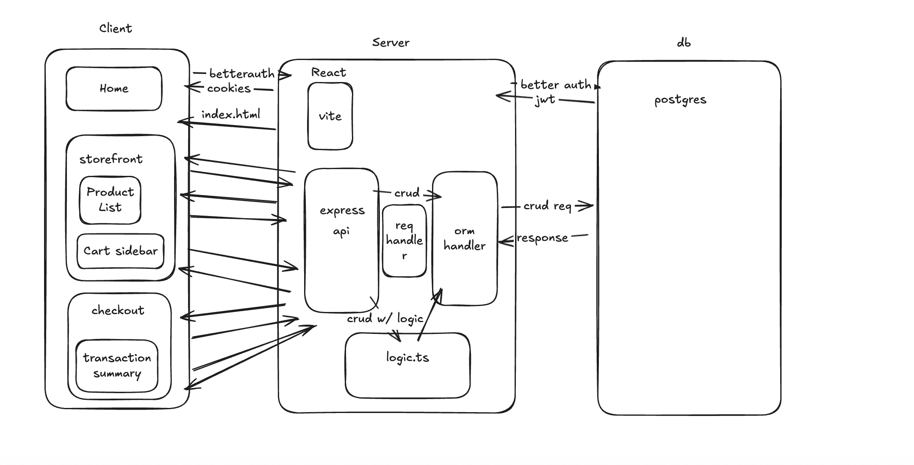

# Objective

Design a minimal Etsy shop with the following features:
 - Storefront displaying all products on sale
 - Ability to buy products (no need to build payments integation for this exercise; just remove the item from the database when "bought")
 - Store admin can manually add more products\

## 1. Core User Flows
For each flow, describe what happens end-to-end with bullet points. 

1) User/Admin Views 'Home Page' with Login/Register Options
2) User/Admin Login/Register from 'Home Page' Redirects to 'Storefront' Page which displays:
   - 'Product List' Products Available with 'Add to Cart' Button Under each Product. 
   - 'Cart Sidebar' Togglable Display for Products Added to Cart with 'Go To Checkout' button
3) User Clicks 'Go to Checkout' (in Cart Sidebar) -> Redirected to 'Checkout' Page from Product List
   - User fills in Shipping/Billing Information and Clicks 'Purchase' -> Redirects to Transaction Summary Page
4) If Admin: Display 'Manage Products' Button that Redirects to 'Product Management' Page on 'Storefront Page'
- Admin Adds/Removes Products from Product List (Admin Inventory Page) 

 ## 2. Data models
List your tables and columns, with primary keys and any unique constraints or indexes you need for V1. Include 1–2 example rows where helpful.

- User
  - UUID
  - Name
  - Role
  - Cart
    - Product : Product[]

- Product
  - UUID
  - Name: String
  - Price: Number
  - Inventory: Number
  - Product Details : String (Details, Shipping Requirements, Etc)

## 3. Architecture Diagram
Attach a simple boxes-and-arrows diagram showing client, API server, and database. Label arrows with the main requests (e.g., "POST /follow", "GET /timeline"). Keep it legible and minimal.

## 4. API Sketch
List the minimal endpoints and their request/response shapes at a high level. Keep this terse.

- User Scoped
- `GET /Products` - Return All Products (Displaying to Storefront Product List) Error: No Products Available || Unauthorized (Requires role User/Admin)
- `GET /Product/{productId}` Return Product w/ ID (Retrieve Specific Product Information, Ex, Inventory Management, Sales, Can Sell, Content, etc ) Errors: Invalid ID || Doesn't Exist || Unauthorized Requires role User/Admin
- `POST /Product/update/{productId}` Update Product w/ID (Self-Explanatory, update mentioned in get product) Error: Invalid Product Data Received
- `POST /Cart/add/{productId}` Add Product to User Cart
- `DEL /Cart/add/{productId}` Remove Product from User Cart
- Admin Scoped
- `DEL /Product/delete/{id}` Remove Product w/ID (Admin) -  Errors: Invalid Product ID (Doesn't Exist || Invalid || Unauthorized: Required Role Admin
- `POST /Product/add/{id}` Add Product w/ID (Admin) - Errors: Invalid Product Data Recieved || Unauthorized: Requires Role Admin

Route protection: Better Auth and Scope defined in user, handled on server and client side.

Diagram ( I ran out of time to finish this, sorry that flew buy and I thought I had more time)
