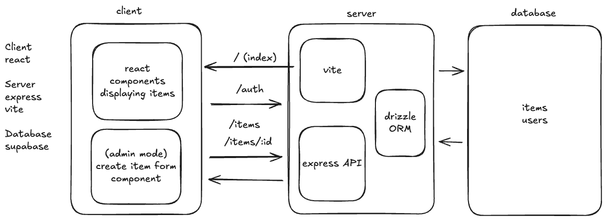

# Objective

Design a minimal Etsy shop with the following features:
 - Storefront displaying all products on sale
 - Ability to buy products (no need to build payments integation for this exercise; just remove the item from the database when "bought")
 - Store admin can manually add more products

## 1. Core User Flows
For each flow, describe what happens end-to-end with bullet points.
- Display storefront
  * User visits store website
  * Storefront view is populated with items from the database (added by shop admin)
  * The view is a grid of item components each displaying a different item
  * Items have a price, a description, and a name on display, and a buy button

- Buying products
  * A user viewing the storefront clicks a button on an item to purchase it
  * Item is removed from the grid and from the database

- Adding products in admin mode
  * An admin can login with a form on the storefront UI's top menu
  * A logged in user with admin priveleges can click on a Manage Store button that appears to them on the storefront
  * The admin has access to an Add Items form that appears upon activating the Manage Store state. They can input the name of the item, upload an image of the item, and set the price of the item, and then submit the form adding the item to the database

Focus on the path of a request and what data is read or written.

 ## 2. Data models
List your tables and columns, with primary keys and any unique constraints or indexes you need for V1. Include 1–2 example rows where helpful.

Items Table
id: uuid (not null) (primary key)
name: string (not null)
description: string
imageUrl: string 
price: integer (not null)
userId: uuid (not null)
createdAt: timestamp
updatedAt: timestamp

Item Example:
id: haoiwhdad-0129ud-10ihadah
name: Epic Scarf
description: Beautiful epic scarf that will turn heads wherever you go
imageUrl: https://www.imgur.com/09uaoaikshd/
price: 200
userId: balkdihal-290uawsak-02iadjcabh
createdAt: 2025-10-14-20:32
updatedAt: 2025-10-14-20:32

Users Table
id: uuid (not null) (primary key)
name: string (not null)
email: string (not null)
passwordHash: string (not null)
isAdmin: boolean
createdAt: timestamp
updatedAt: timestamp

User Example:
id: balkdihal-290uawsak-02iadjcabh
name: Matthew Huff
email: matthewhuff2000@gmail.com
passwordHash: uaw0udbalkndwv0wa9cuacw
isAdmin: true
createdAt: 1989-01-14-20:32
updatedAt: 2025-10-14-20:32

## 3. Architecture Diagram
Attach a simple boxes-and-arrows diagram showing client, API server, and database. Label arrows with the main requests (e.g., "POST /follow", "GET /timeline"). Keep it legible and minimal.

## 4. API Sketch
List the minimal endpoints and their request/response shapes at a high level. Keep this terse.

- GET /items:
  Input: None
  Output: Item[]

- POST /auth:
  Input: User Email & Password
  Output: JSON Web Token | Error (Invalid Information)

- POST /items
  Input: Item (form data)
  Output: Item | Error (invalid item data)

- POST /items/:id
  Input: User
  Output: Removed item from DB, Confirmation Message | Error (item not found)

State what each returns on success and what errors matter in V1.