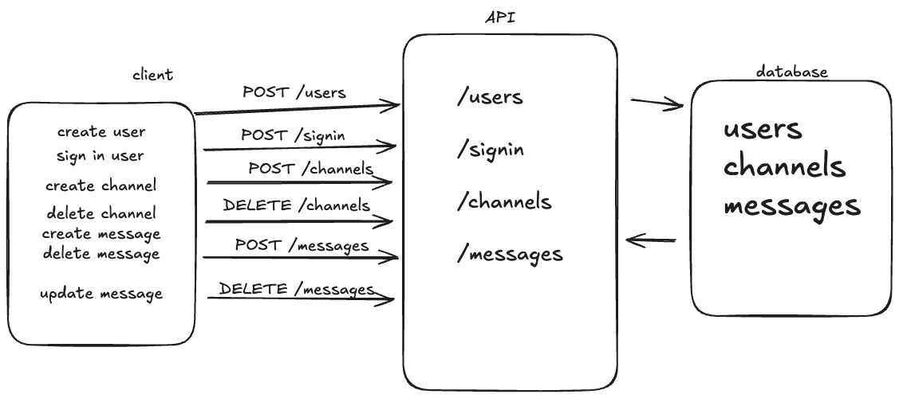

# Objective

Design a minimal Discord with the following features:
 - Users
 - Channels that can be created/deleted
 - Users can post into channels (text only messages)
 - Reactions (add an emoji reaction to someone's message)

 ## 1. Overview
Describe the product slice you are building. What can a user do in V1, and what is explicitly out of scope? In 4–6 sentences, explain the overall shape of the system (client → API → database) and how data moves through it at a high level.

- We are building out a platform for text messaging and chatting. In this platform, there are "channels" which are containers of messages, that users can subscribe to and join and begin posting messages. Users will be able to create profiles and sign in and out of the platform. When they are signed in they will be able to see an interface with all of the channels they have access to. Users also have the ability to add "reactions" to messages in channels, using emojis to express themselves further in response to others messages. The client hits the API first to log-in a user, and then after a user is logged in, the client hits the API again to populate itself with a user's subscribed channels. When a user posts a message on the client, it hits the API and then the server adds it to the database. 

## 2. Architecture Diagram
Attach a simple boxes-and-arrows diagram showing client, API server, and database. Label arrows with the main requests (e.g., "POST /follow", "GET /timeline"). Keep it legible and minimal.

## 3. Core User Flows
For each flow, describe what happens end-to-end in a few short paragraphs. For the Discord question, this might be:
- Follow someone
- Create a post
- Load the home timeline

A user logs onto spiderdiscord.com
A user is served a sign up and sign in form.
A user can fill in their name and choose a password and click a button to submit the form.
The user's information hits POST /users and creates a user object and saves it to the database.
The user can then log-in, which hits POST /signin, and returns a cookie/session with a token authenticating them to log in.

Upon being logged in, a user can see a variety of channels. They also have an access to a small form allowing them to create a new channel with a name input and a button. The channels that belong to that user can also be deleted with a button prompt. The user can click on a channel's name and enter that channel, and it hits the GET /channels/:id route. The channel information, along with it's associated messages are retrieved from the database and served up to the client, populating a view that shows messages from a variety of users.

A user can use a form in that channel's view to submit new messages, which are POSTed to /messages and given a userId, a channelId, along with the content and primary id. Users can also interact with messages by right clicking on them and selecting an emoji as a reaction, which will then appear on the message object along with a count for if multiple users respond with the same emoji. When a user reacts to a message, a POST is made to /messages/:id to update the message object's reactions field with a JSON map of reactions

Focus on the path of a request and what data is read or written.

## 4. Data Models
List your tables and columns, with primary keys and any unique constraints or indexes you need for V1. Include 1–2 example rows where helpful.

Users:
- id
- username
- name
- password
- createdAt
- updatedAt

Channels:
- id
- userId
- name
- createdAt
- updatedAt

Messages:
- id
- userId
- channelId
- content
- reactions
- createdAt
- updatedAt

## 5. API Sketch
List the minimal endpoints and their request/response shapes at a high level. Keep this terse.

- `POST /users`
- `POST /channels`
- `DELETE /channels`
- `POST /messages`
- `PUT /messages`
- `DELETE /messages`
- `GET /messages`

State what each returns on success and what errors matter in V1.