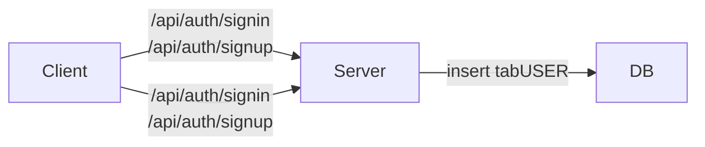
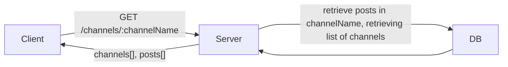
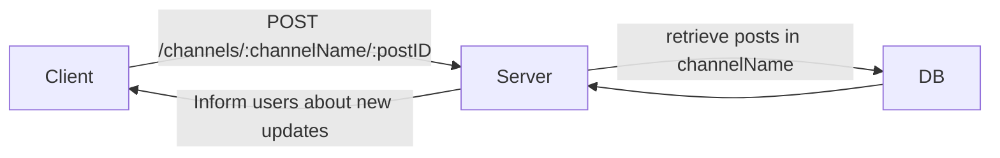

# Objective

Design a minimal Discord with the following features:
 - Users
 - Channels that can be created/deleted
 - Users can post into channels (text only messages)
 - Reactions (add an emoji reaction to someone's message)

 ## 1. Overview
Describe the product slice you are building. What can a user do in V1, and what is explicitly out of scope? In 4–6 sentences, explain the overall shape of the system (client → API → database) and how data moves through it at a high level.

A user can:
- Read messages in a channel
- Post a message into a channel
- Edit a message they have posted
- React to messages with an emoji
- See listed channels they are permitted to see
- Switch to other channels

The overall shape of the system.
Users primarily interact with posts in a given channel.

We will use a single page app where user clients query for information the server as necessary. 
Clients send Post-related actions to the server. When a client is logged in, they establish a socket to be pushed information by the server about new posts across various channels.
The server handles long-term storage by saving new posts, reactions, and channels to the database. The server follows up on successful updates by notifying all logged-in clients that there are new messages.

Channels may be created and deleted in order to create a new disjunct category for posts to reside in.
Posts belong to specific channels. Users' reactions also belong to specific posts.

## 2. Architecture Diagram
Attach a simple boxes-and-arrows diagram showing client, API server, and database. Label arrows with the main requests (e.g., "POST /follow", "GET /timeline"). Keep it legible and minimal.

Loading list of channels, loading posts in a channel

POST: Creating posts, editing posts, sending reactions

## 3. Core User Flows
For each flow, describe what happens end-to-end in a few short paragraphs. For the Twitter question, this might be:
- Follow someone
- Create a post
- Load the home timeline

Focus on the path of a request and what data is read or written.

User Flow.
After a user logs in, they are greeted with the default channel. 
From there, they can 
- read messages in that channel
- react to messages with an emoji (including their own)
- see existing reactions
- switch to other channels, where they have the same set of affordances.

## 4. Data Models
List your tables and columns, with primary keys and any unique constraints or indexes you need for V1. Include 1–2 example rows where helpful.

tabUsers
- userId :: primary key, uuid
- name :: string, not null

tabPosts
- postId :: primary key, uuid
- content :: string, not null
- user :: foreign key, tabUsers.userId

tabReactions
- postId :: foreign key, tabPosts.postId
- emoji :: string, not null
- user :: foreign key, tabUser.userId

tabChannels
- channelId :: primary key, uuid
- name :: string, not null

## 5. API Sketch
List the minimal endpoints and their request/response shapes at a high level. Keep this terse.

- `POST /follow`
- `POST /posts`
- `GET /timeline`

State what each returns on success and what errors matter in V1.
