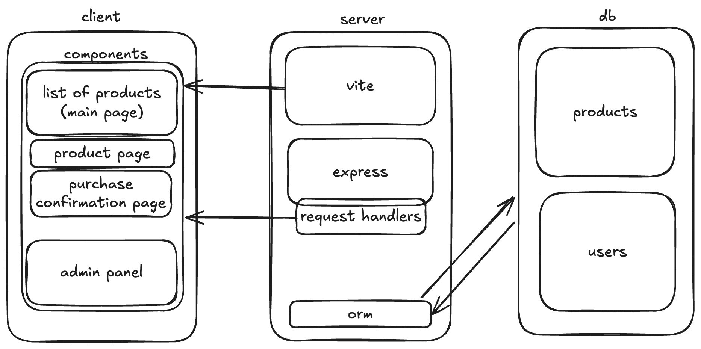

# Objective

Design a minimal Etsy shop with the following features:
 - Storefront displaying all products on sale
 - Ability to buy products (no need to build payments integation for this exercise; just remove the item from the database when "bought")
 - Store admin can manually add more products

## 1. Core User Flows
For each flow, describe what happens end-to-end with bullet points. For the Twitter question, this might be:
- Follow someone
- Create a post
- Load the home timeline

Focus on the path of a request and what data is read or written.

### See what's on sale and make a purchase
- user opens the store page
- opens page of one of the items
- clicks purchase button
- sees confirmation page

### Adding products (admin)
- admin opens admin panel
- fills the form with all the product info (on the same page sor simplicity)
- clicks confirmation button

## 2. Data models
List your tables and columns, with primary keys and any unique constraints or indexes you need for V1. Include 1–2 example rows where helpful.

### Products
- id: uuid
- name: string
- description: string
- price: number

### Users
- id: uuid
- name: string
- email: string
- password: string
- isAdmin: boolean

## 3. Architecture Diagram
Attach a simple boxes-and-arrows diagram showing client, API server, and database. Label arrows with the main requests (e.g., "POST /follow", "GET /timeline"). Keep it legible and minimal.

## 4. API Sketch
List the minimal endpoints and their request/response shapes at a high level. Keep this terse.

For twitter:
- `POST /follow`
- `POST /posts`
- `GET /timeline`

State what each returns on success and what errors matter in V1.

### GET /products
Input: none
Output: Product[]

### GET /product/{id}
Input: none
Output: Product

### POST /product/{id}/buy
Input: id
Output: confirmation component returned, product deleted

### GET /adminpanel
Input: none
Output: Product[]

### POST /adminpanel/new
Input: Product
Output: confirmation, product added